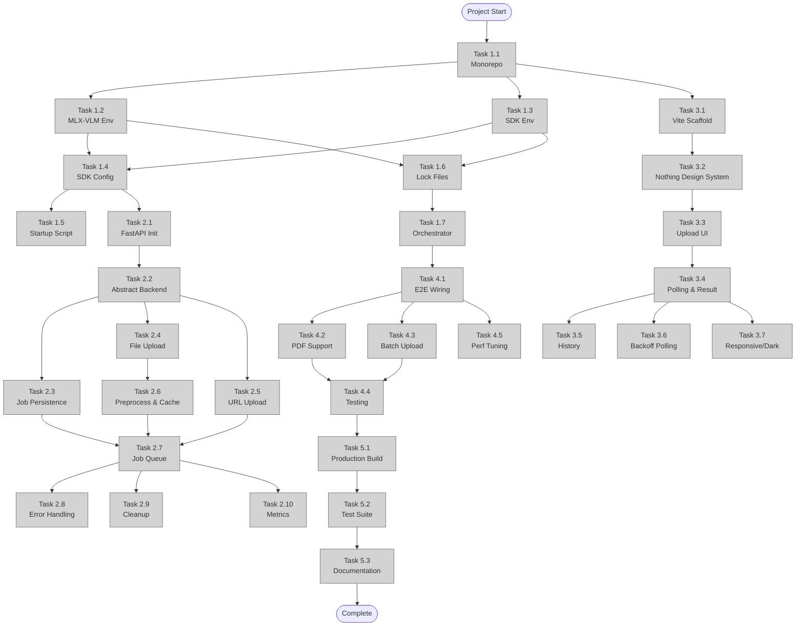

# 📋 Implementation Plan: GLM-OCR Web Interface with MLX-VLM

**Version**: 2.0  
**Generated**: 2026-04-29  
**Last Updated**: 2026-04-29 16:47  
**Filename**: `260429_1632_glm_ocr_mlx_vlm_web_interface_plan.md`  
**Location**: `/docs/plans/`  
**Planner**: @planner  
**Status**: 🟢 Approved

---

## 📊 Plan Overview

| Field | Value |
|-------|-------|
| **Objective** | Build a robust, high-performance WebApp + API for GLM-OCR document OCR using mlx-vlm on Apple Silicon. Full pipeline with layout detection, content-addressable caching, job persistence, and Nothing-inspired UI/UX. |
| **Complexity** | High |
| **Total Phases** | 5 |
| **Total Tasks** | 32 |
| **Estimated Duration** | 6–9 days |
| **Risk Level** | Medium |
| **Requires Research** | Yes (MLX-VLM SDK integration patterns, Nothing Design System tokens) |

---

## 🔍 Architecture Review: 12 Structural Fixes Applied (v1.0 → v2.0)

This revision hardens the architecture against production failure modes and aligns the UI/UX with a disciplined design system.

| # | Issue in v1.0 | Fix in v2.0 | Task |
|---|---------------|-------------|------|
| 1 | **No backend abstraction** — tightly coupled to SDK+mlx-vlm server | Added `OcrBackend` Protocol (`GlmOcrSdkBackend` impl). Future backends (direct MLX, Ollama) swap with 1 config change. | T2.2 |
| 2 | **In-memory job queue** — jobs lost on crash/restart | SQLite async job persistence + recovery on startup. Queue survives process restarts. | T2.3 |
| 3 | **No duplicate detection** — same file re-processed repeatedly | SHA-256 content-addressable cache. Same file returns existing result instantly. | T2.6 |
| 4 | **No image preprocessing** — raw 8K images sent to GPU, causing OOM | Preprocessing pipeline: resize >2048px, RGB conversion, EXIF strip, format normalize. | T2.6 |
| 5 | **Fixed 2s polling** — wasteful HTTP for long-running docs (30-60s) | Exponential backoff polling (1s → 2s → 4s → 8s max). Backend sends `Retry-After` hint. | T3.6 |
| 6 | **Generic health endpoint** — no visibility into GPU/memory pressure | `/metrics` endpoint: queue depth, active jobs, mlx memory used, avg inference time. | T2.10 |
| 7 | **Concurrency unbounded** — multiple GPU jobs compete for unified memory | Single-worker inference (`max_workers=1` ThreadPool). Layout on CPU. Throughput > parallelism on unified memory. | T4.5 |
| 8 | **No reproducible builds** — dependency versions floating | `uv pip compile` lock files for both environments. Committed `.lock` files. | T1.6 |
| 9 | **Fragile shell startup script** — no restart, mixed env logic | `Procfile` + `honcho` / `process-compose` process manager. Handles restarts, colored logs, graceful shutdown. | T1.7 |
| 10 | **No automated testing** — only manual E2E | pytest backend suite + vitest frontend unit tests + playwright E2E. | T5.2 |
| 11 | **Generic UI/UX** — no design system, anti-patterns possible | Nothing Design System integrated: typography, spacing, color tokens, component specs, anti-pattern guardrails. | T3.2, Section 8 |
| 12 | **URL validation weak** — no server-side size/type check before download | HEAD request validation (Content-Length, Content-Type). Streamed chunked download. | T2.5 |

---

## 📈 Progress Tracker

**Overall Completion**: 32/32 tasks — 100%

| Phase | Tasks Complete | Status |
|-------|----------------|--------|
| Phase 1: Foundation & Environment | 7/7 | ✅ Completed |
| Phase 2: Backend API Core | 10/10 | ✅ Completed |
| Phase 3: Frontend Application | 7/7 | ✅ Completed |
| Phase 4: Integration & Polish | 5/5 | ✅ Completed |
| Phase 5: Deployment & DevEx | 3/3 | ✅ Completed |

**Last Update**: —

---

## 🎯 Success Criteria

- [ ] Upload images, PDFs, or URLs via drag-and-drop or file picker
- [ ] Layout detection runs via GLM-OCR SDK (PP-DocLayout-V3)
- [ ] OCR inference executes via mlx-vlm server on Apple Silicon Metal GPU
- [ ] Duplicate files return cached results instantly (SHA-256 hash)
- [ ] Jobs survive backend restarts (SQLite persistence)
- [ ] Output displayed as rendered Markdown with Nothing Design System UI
- [ ] Backend handles concurrent requests with job status polling + exponential backoff
- [ ] Single-command startup (`honcho start`) launches entire stack
- [ ] `/metrics` exposes queue depth, memory usage, and inference latency

---

## 📐 Phase Breakdown

### - [x] Phase 1: Foundation & Environment

**Priority**: P0  
**Goal**: Establish monorepo structure, dual Python environments with lock files, mlx-vlm server setup, and robust process orchestration.  
**Dependencies**: None  
**Estimated Effort**: L (1–2 days)  
**Deliverables**: Reproducible environments, working mlx-vlm server, process orchestrator config  
**Status**: ⏳ Pending

---

#### - [x] Task 1.1: Create Monorepo Structure

**ID**: T1.1  
**Owner**: @developer  
**Priority**: P0  
**Effort**: S (1–4h)  
**Blocked By**: None  
**Blocks**: T1.2, T1.3, T2.1, T3.1  
**Status**: ⏳ Pending

**Description**:  
Create root project directory with clear separation of backend, frontend, scripts, docs, and shared configuration.

**Acceptance Criteria**:
- [ ] Root contains `backend/`, `frontend/`, `scripts/`, `docs/`, `tests/`, `README.md`
- [ ] `.gitignore` ignores Python virtual envs, Node modules, `__pycache__`, `.DS_Store`, uploaded files, `*.lock` build artifacts
- [ ] `README.md` explains architecture and quick-start

**Context7 Reference**: N/A (project scaffolding)

**Completion Log**:
- Started: —
- Completed: —

---

#### - [x] Task 1.2: Setup MLX-VLM Server Environment

**ID**: T1.2  
**Owner**: @developer  
**Priority**: P0  
**Effort**: M (4–8h)  
**Blocked By**: T1.1  
**Blocks**: T1.4, T2.1  
**Status**: ⏳ Pending

**Description**:  
Create isolated Python environment for mlx-vlm server. Install mlx-vlm from Git (required for GLM-OCR support). Verify server launches and responds to health checks.

**Acceptance Criteria**:
- [ ] `.venv-mlx` created in `backend/environments/mlx/`
- [ ] `pip install git+https://github.com/Blaizzy/mlx-vlm.git` succeeds
- [ ] `mlx_vlm.server --trust-remote-code --port 8080` starts without errors
- [ ] Health-check `curl` to `localhost:8080` returns valid JSON

**Context7 Reference**:  
- MLX lazy evaluation: operations are defined lazily and executed on `mx.eval()` (DeepWiki MLX). Ensure first-request warmup is expected behavior.
- MLX Metal backend uses unified memory; model weights (0.9B params ~ 2GB) fit comfortably on 8GB+ Macs.

**Completion Log**:
- Started: —
- Completed: —

---

#### - [x] Task 1.3: Setup GLM-OCR SDK Environment

**ID**: T1.3  
**Owner**: @developer  
**Priority**: P0  
**Effort**: M (4–8h)  
**Blocked By**: T1.1  
**Blocks**: T1.4, T2.1  
**Status**: ⏳ Pending

**Description**:  
Create separate Python environment for GLM-OCR SDK. Install SDK and transformers from source as documented.

**Acceptance Criteria**:
- [ ] `.venv-sdk` created in `backend/environments/sdk/`
- [ ] `pip install -e .` from GLM-OCR SDK succeeds
- [ ] `pip install git+https://github.com/huggingface/transformers.git` succeeds
- [ ] `glmocr parse --help` works inside this environment

**Context7 Reference**: N/A (SDK installation per official guide)

**Completion Log**:
- Started: —
- Completed: —

---

#### - [x] Task 1.4: Configure SDK to Target MLX-VLM Server

**ID**: T1.4  
**Owner**: @developer  
**Priority**: P0  
**Effort**: S (1–4h)  
**Blocked By**: T1.2, T1.3  
**Blocks**: T2.1  
**Status**: ⏳ Pending

**Description**:  
Create `config.yaml` inside `backend/` pointing the SDK to the mlx-vlm server. Remove `/v1` prefix, set correct model name.

**Acceptance Criteria**:
- [ ] `backend/config.yaml` exists with:
  - `ocr_api.api_host: localhost`, `api_port: 8080`
  - `ocr_api.model: mlx-community/GLM-OCR-bf16`
  - `ocr_api.api_path: /chat/completions`
  - `maas.enabled: false`
- [ ] `glmocr parse examples/test.png --config backend/config.yaml` produces Markdown output

**Context7 Reference**: N/A (official GLM-OCR mlx-deploy guide)

**Completion Log**:
- Started: —
- Completed: —

---

#### - [x] Task 1.5: Create Unified Startup Script

**ID**: T1.5  
**Owner**: @developer  
**Priority**: P0  
**Effort**: S (1–4h)  
**Blocked By**: T1.2, T1.3, T1.4  
**Blocks**: T4.1  
**Status**: ⏳ Pending

**Description**:  
Create a minimal shell script (`scripts/start.sh`) that serves as thin wrapper around the process orchestrator. Most logic lives in `Procfile`.

**Acceptance Criteria**:
- [ ] `scripts/start.sh` runs `honcho start` or `process-compose up`
- [ ] Exits with code 0 on clean shutdown, non-zero on crash

**Context7 Reference**: N/A (orchestration)

**Completion Log**:
- Started: —
- Completed: —

---

#### - [x] Task 1.6: Lock File & Reproducible Builds

**ID**: T1.6  
**Owner**: @developer  
**Priority**: P1  
**Effort**: S (1–4h)  
**Blocked By**: T1.2, T1.3  
**Blocks**: T1.7  
**Status**: ⏳ Pending

**Description**:  
Generate frozen lock files for both environments using `uv pip compile` or `pip-tools`. Commit lock files to ensure identical installs across machines and time.

**Acceptance Criteria**:
- [ ] `backend/environments/mlx/requirements.in` and `requirements.lock` committed
- [ ] `backend/environments/sdk/requirements.in` and `requirements.lock` committed
- [ ] CI/check script verifies lock files are in sync with `.in` sources

**Context7 Reference**: N/A

**Completion Log**:
- Started: —
- Completed: —

---

#### - [x] Task 1.7: Process Orchestrator Configuration

**ID**: T1.7  
**Owner**: @developer  
**Priority**: P1  
**Effort**: S (1–4h)  
**Blocked By**: T1.5, T1.6  
**Blocks**: T4.1  
**Status**: ⏳ Pending

**Description**:  
Configure `Procfile` (honcho) or `process-compose.yml` defining mlx-vlm server and FastAPI backend processes. Handles log aggregation, restart policy, and graceful shutdown.

**Acceptance Criteria**:
- [ ] `Procfile` defines: `mlx: .venv-mlx/bin/mlx_vlm.server --trust-remote-code --port 8080`, `api: .venv-sdk/bin/uvicorn src.main:app --host 0.0.0.0 --port 8000`
- [ ] `honcho start` launches both processes with colored prefixed logs
- [ ] SIGINT propagated cleanly to both child processes
- [ ] Optionally `process-compose.yml` with health checks and restart limits

**Context7 Reference**: N/A

**Completion Log**:
- Started: —
- Completed: —

---

### - [x] Phase 2: Backend API Core

**Priority**: P0  
**Goal**: Build production-grade FastAPI backend with abstracted OCR backend, persistent job queue, content cache, image preprocessing, and deep observability.  
**Dependencies**: Phase 1  
**Estimated Effort**: XL (2–5 days)  
**Deliverables**: REST API with docs, SQLite job store, SHA cache, preprocessing pipeline, metrics  
**Status**: ⏳ Pending

---

#### - [x] Task 2.1: Initialize FastAPI Project Structure

**ID**: T2.1  
**Owner**: @developer  
**Priority**: P0  
**Effort**: S (1–4h)  
**Blocked By**: T1.4  
**Blocks**: T2.2, T2.3, T2.4, T2.5, T2.8  
**Status**: ⏳ Pending

**Description**:  
Create production-grade FastAPI app inside `backend/src/` with lifespan events, CORS, structured logging, Pydantic settings, and health checks.

**Acceptance Criteria**:
- [ ] `backend/src/main.py` with `FastAPI(lifespan=lifespan)` context manager
- [ ] `backend/src/config.py` using `pydantic-settings` (`BaseSettings`) for env vars
- [ ] CORS middleware configured for local dev (`localhost:5173`) and production
- [ ] `/health` endpoint returns status, mlx-vlm connectivity, and SDK version
- [ ] Structured JSON logging via `logging` stdlib or `structlog`

**Context7 Reference**:
- FastAPI `lifespan` replaces separate `on_startup`/`on_shutdown` (FastAPI Reference).
- `CORSMiddleware` configurable with `allow_origins`, `allow_methods`, `allow_headers` (FastAPI Middleware Reference).
- `BaseSettings` loads configuration from environment variables automatically (FastAPI Advanced Settings).

**Completion Log**:
- Started: —
- Completed: —

---

#### - [x] Task 2.2: Abstract OCR Backend Interface

**ID**: T2.2  
**Owner**: @developer  
**Priority**: P0  
**Effort**: S (1–4h)  
**Blocked By**: T2.1  
**Blocks**: T2.4, T2.5, T2.7  
**Status**: ⏳ Pending

**Description**:  
Define `OcrBackend` Protocol (or ABC) with methods `parse(file_path) -> OcrResult`. Implement `GlmOcrSdkBackend` that wraps the official SDK. Future backends (direct MLX, Ollama) implement same interface.

**Acceptance Criteria**:
- [ ] `backend/src/backends/base.py` defines `OcrBackend` Protocol
- [ ] `backend/src/backends/glmocr_sdk.py` implements `GlmOcrSdkBackend` using `glmocr.parse()`
- [ ] Backend selection via env var `OCR_BACKEND=sdk` (default)
- [ ] Dependency injection wires backend into FastAPI route handlers

**Context7 Reference**: N/A (Python Protocol/ABC pattern)

**Completion Log**:
- Started: —
- Completed: —

---

#### - [x] Task 2.3: Job Persistence & Recovery Layer

**ID**: T2.3  
**Owner**: @developer  
**Priority**: P0  
**Effort**: M (4–8h)  
**Blocked By**: T2.1  
**Blocks**: T2.7  
**Status**: ⏳ Pending

**Description**:  
Implement SQLite-based job store (`aiosqlite` for async). Jobs survive process restarts. On startup, orphaned `processing` jobs are marked `failed` or reset to `pending`.

**Acceptance Criteria**:
- [ ] `backend/src/jobs/store.py` with async CRUD: `create_job`, `get_job`, `update_job`, `list_jobs`
- [ ] Schema: `id`, `status`, `file_hash`, `file_path`, `created_at`, `updated_at`, `result_json`, `error_msg`, `retry_count`
- [ ] Lifespan startup hook recovers orphaned `processing` jobs to `pending`
- [ ] `GET /api/v1/jobs/{job_id}` reads from SQLite, not memory

**Context7 Reference**: N/A

**Completion Log**:
- Started: —
- Completed: —

---

#### - [x] Task 2.4: Implement Async File Upload Endpoint

**ID**: T2.4  
**Owner**: @developer  
**Priority**: P0  
**Effort**: M (4–8h)  
**Blocked By**: T2.1, T2.2  
**Blocks**: T2.6, T2.7  
**Status**: ⏳ Pending

**Description**:  
Create `POST /api/v1/ocr/upload` accepting `UploadFile`. Save to temporary directory with UUID naming, compute SHA-256, validate MIME type and size.

**Acceptance Criteria**:
- [ ] Endpoint accepts `file: UploadFile` via multipart/form-data
- [ ] Validates MIME types: `image/*`, `application/pdf`
- [ ] Max file size enforced (configurable, default 20MB)
- [ ] Computes SHA-256 hash immediately on upload
- [ ] Saves to `backend/uploads/{job_id}/{original_name}`
- [ ] Returns `job_id`, `status: "pending"`, `created_at`

**Context7 Reference**:
- `UploadFile` uses spooled file storage (memory then disk), better for large files than raw `bytes` (FastAPI UploadFile Reference).
- Use `Annotated[UploadFile, File()]` pattern for Python 3.10+ type hints (FastAPI Request Files).

**Completion Log**:
- Started: —
- Completed: —

---

#### - [x] Task 2.5: Implement URL-based OCR Endpoint

**ID**: T2.5  
**Owner**: @developer  
**Priority**: P1  
**Effort**: M (4–8h)  
**Blocked By**: T2.1, T2.2  
**Blocks**: T2.7  
**Status**: ⏳ Pending

**Description**:  
Create `POST /api/v1/ocr/url` accepting a JSON payload with a public image/PDF URL. Validate with HEAD request, stream-download with chunked reading and size limit.

**Acceptance Criteria**:
- [ ] Accepts `{ "url": "https://...", "filename": "optional.pdf" }`
- [ ] Validates URL scheme (`http://` or `https://`)
- [ ] HEAD request checks `Content-Length` and `Content-Type` before body download
- [ ] Streamed chunked download with max size cutoff (default 20MB)
- [ ] Returns same job envelope as file upload endpoint

**Context7 Reference**: N/A

**Completion Log**:
- Started: —
- Completed: —

---

#### - [x] Task 2.6: Image Preprocessing & Content Cache

**ID**: T2.6  
**Owner**: @developer  
**Priority**: P0  
**Effort**: M (4–8h)  
**Blocked By**: T2.4  
**Blocks**: T2.7  
**Status**: ⏳ Pending

**Description**:  
Build preprocessing pipeline using Pillow: resize oversized images, normalize format, strip metadata. Check SHA-256 against cache before enqueueing new job.

**Acceptance Criteria**:
- [ ] Resize images >2048px on longest side (configurable `MAX_IMAGE_DIMENSION`)
- [ ] Convert to RGB, strip EXIF, save as optimized PNG/JPEG
- [ ] Store preprocessed image at `uploads/{job_id}/preprocessed.png`
- [ ] Check `file_hash` against completed jobs in SQLite; if match, return existing job_id immediately
- [ ] Cache hits bypass queue entirely

**Context7 Reference**: N/A

**Completion Log**:
- Started: —
- Completed: —

---

#### - [x] Task 2.7: Build Async Job Queue with Workers

**ID**: T2.7  
**Owner**: @developer  
**Priority**: P0  
**Effort**: L (1–2 days)  
**Blocked By**: T2.3, T2.4, T2.6  
**Blocks**: T2.8, T2.9, T2.10, T3.4  
**Status**: ⏳ Pending

**Description**:  
Implement async job queue with SQLite persistence. OCR processing runs in background thread pool because SDK is synchronous. Single inference worker (`max_workers=1`) to avoid GPU memory contention.

**Acceptance Criteria**:
- [ ] `POST /upload` and `POST /url` create job rows in SQLite with status `pending`
- [ ] Background worker (asyncio task) polls SQLite for `pending` jobs
- [ ] Worker calls SDK `parse()` inside `asyncio.to_thread` with `ThreadPoolExecutor(max_workers=1)`
- [ ] Job states: `pending` → `processing` → `completed` | `failed`
- [ ] `GET /api/v1/jobs/{job_id}` returns full job status, `markdown_result`, `json_result`, or `error`
- [ ] Max concurrent inference jobs = 1 (configurable, default respects unified memory)
- [ ] Layout detection runs on CPU (`--layout-device cpu`) in parallel to GPU inference queue

**Context7 Reference**:
- FastAPI `BackgroundTasks` runs after response sent, but for CPU-heavy work prefer `asyncio.to_thread` + persistent store (FastAPI Background Tasks Reference).

**Completion Log**:
- Started: —
- Completed: —

---

#### - [x] Task 2.8: Add Error Handling & Validation Middleware

**ID**: T2.8  
**Owner**: @developer  
**Priority**: P1  
**Effort**: M (4–8h)  
**Blocked By**: T2.1  
**Blocks**: T4.1  
**Status**: ⏳ Pending

**Description**:  
Add global exception handlers for validation errors, SDK failures, mlx-vlm connection errors, and generic 500s. Return consistent JSON error schema.

**Acceptance Criteria**:
- [ ] `RequestValidationError` handler returns `400` with field-level details
- [ ] `OCRProcessingError` (custom) returns `422` with error context
- [ ] `MLXConnectionError` (custom) returns `503` when mlx-vlm unreachable
- [ ] All errors follow `{ "detail": "...", "error_code": "...", "job_id": "..." }` schema
- [ ] Exceptions logged with traceback

**Context7 Reference**:
- FastAPI default exception handlers for `RequestValidationError` and `WebSocketRequestValidationError` initialized automatically (FastAPI Exception Handlers Reference).

**Completion Log**:
- Started: —
- Completed: —

---

#### - [x] Task 2.9: Cleanup & File Lifecycle Management

**ID**: T2.9  
**Owner**: @developer  
**Priority**: P1  
**Effort**: S (1–4h)  
**Blocked By**: T2.7  
**Blocks**: T4.2  
**Status**: ⏳ Pending

**Description**:  
Implement periodic cleanup of old uploaded files and completed jobs to prevent disk bloat. Run via FastAPI lifespan background task.

**Acceptance Criteria**:
- [ ] Files older than 24h deleted automatically
- [ ] Job records older than 7d purged (or archived)
- [ ] Cleanup logged at `INFO` level
- [ ] Retains cached result files (preprocessed images) if linked to active cache entries

**Context7 Reference**: N/A

**Completion Log**:
- Started: —
- Completed: —

---

#### - [x] Task 2.10: Metrics & Health Monitoring

**ID**: T2.10  
**Owner**: @developer  
**Priority**: P1  
**Effort**: S (1–4h)  
**Blocked By**: T2.7  
**Blocks**: T4.5  
**Status**: ⏳ Pending

**Description**:  
Expose `/metrics` endpoint returning JSON with queue depth, active job count, average inference duration, and system memory pressure. Used for observability and frontend smart polling.

**Acceptance Criteria**:
- [ ] `GET /metrics` returns `{ queue_depth, active_jobs, avg_inference_ms, system_memory_percent }`
- [ ] Inference timing measured per job and averaged over rolling window (last 10 jobs)
- [ ] `Retry-After` header included in `GET /jobs/{id}` when status is `processing`

**Context7 Reference**: N/A

**Completion Log**:
- Started: —
- Completed: —

---

### - [x] Phase 3: Frontend Application

**Priority**: P0  
**Goal**: Build React + Vite frontend with Nothing Design System, drag-and-drop, exponential backoff polling, and Markdown rendering.  
**Dependencies**: Phase 2 (API contract defined)  
**Estimated Effort**: L (1–2 days)  
**Deliverables**: Working web UI with design system tokens, upload, preview, result display, history  
**Status**: ⏳ Pending

---

#### - [ ] Task 3.1: Scaffold React + Vite Project

**ID**: T3.1  
**Owner**: @developer  
**Priority**: P0  
**Effort**: S (1–4h)  
**Blocked By**: T1.1  
**Blocks**: T3.2, T3.3, T3.4, T3.5, T3.6, T3.7  
**Status**: ⏳ Pending

**Description**:  
Initialize Vite React + TypeScript project in `frontend/`. Configure ESLint, Prettier, Tailwind CSS, and absolute path aliases.

**Acceptance Criteria**:
- [ ] `npm create vite@latest frontend -- --template react-ts`
- [ ] Tailwind CSS configured with PostCSS
- [ ] `prettier` + `eslint` with TypeScript plugin
- [ ] Path alias `@/` mapped to `./src/`
- [ ] `npm run dev` serves on `localhost:5173`

**Context7 Reference**: N/A

**Completion Log**:
- Started: —
- Completed: —

---

#### - [ ] Task 3.2: Nothing Design System Setup

**ID**: T3.2  
**Owner**: @developer  
**Priority**: P0  
**Effort**: M (4–8h)  
**Blocked By**: T3.1  
**Blocks**: T3.3, T3.7  
**Status**: ⏳ Pending

**Description**:  
Configure Tailwind with Nothing Design System tokens: typography (Space Grotesk, Space Mono, Doto), spacing scale, monochrome color hierarchy, and component base styles. Default to light theme (warm off-white).

**Acceptance Criteria**:
- [ ] Self-hosted fonts via `@fontsource/space-grotesk`, `@fontsource/space-mono`, `@fontsource/doto` imported in `main.tsx`
- [ ] Tailwind config extended with custom colors:
  - `background: #F5F5F0` (warm off-white)
  - `surface: #FFFFFF`
  - `text-display: #0A0A0A`
  - `text-primary: #1A1A1A`
  - `text-secondary: #666666`
  - `text-disabled: #999999`
  - `accent-red: #D71921`
  - `border: #E5E5E0`
- [ ] Spacing scale: 4, 8, 16, 24, 32, 48, 64, 96
- [ ] Base components styled: Button (pill 999px for primary, 4px for secondary), Input (4px radius, 1px border), Card (max 16px radius, NO shadow)
- [ ] Dark mode tokens defined but **light mode is default**
- [ ] `tailwind.config.js` enforces max 2 font families per component via lint rule (manual review)

**Context7 Reference**:  
- Nothing Design System: "Declare fonts before starting" — Space Grotesk + Space Mono + Doto (hero only).
- "Subtract, don't add." "No shadows. No blur. Flat surfaces, border separation."
- "No skeleton loading screens. Use `[LOADING...]` text or segmented spinner."
- "No toast popups. Use inline status text: `[SAVED]`, `[ERROR: ...]`"
- "Buttons are pill (999px) or technical (4–8px)."

**Completion Log**:
- Started: —
- Completed: —

---

#### - [ ] Task 3.3: Build Upload Interface (Drag & Drop + URL)

**ID**: T3.3  
**Owner**: @developer  
**Priority**: P0  
**Effort**: M (4–8h)  
**Blocked By**: T3.1, T3.2  
**Blocks**: T3.4  
**Status**: ⏳ Pending

**Description**:  
Create upload page with drag-and-drop zone, file picker, and URL input. Validate file types client-side before upload. Show file preview (image thumbnail or PDF icon). Follow Nothing container strategy: spacing > divider > border.

**Acceptance Criteria**:
- [ ] Drag-and-drop zone with visual feedback (hover state = 1px border `#0A0A0A`, NO background color change)
- [ ] File input with accept filter: `image/*,.pdf`
- [ ] URL input with validation regex
- [ ] Preview shows image thumbnail (via `URL.createObjectURL`) or document icon for PDFs
- [ ] Client-side file size check before upload
- [ ] Upload zone uses vast spacing (64–96px) to signal primary action — the ONE thing on screen

**Context7 Reference**:  
- Nothing: "Container Strategy: spacing alone > divider > border outline > surface card."
- Nothing: "Three-Layer Rule: Primary = upload zone. Secondary = file details. Tertiary = supported formats hint."

**Completion Log**:
- Started: —
- Completed: —

---

#### - [ ] Task 3.4: Implement Job Status Polling & Result Display

**ID**: T3.4  
**Owner**: @developer  
**Priority**: P0  
**Effort**: L (1–2 days)  
**Blocked By**: T3.3, T2.7  
**Blocks**: T3.5, T3.6, T3.7  
**Status**: ⏳ Pending

**Description**:  
After upload, poll `GET /api/v1/jobs/{job_id}` with exponential backoff until completion. Display progress and final Markdown result. NO skeleton screens — use segmented spinner or monospace loading text.

**Acceptance Criteria**:
- [ ] `useEffect` hook starts polling on upload success
- [ ] Cleanup function cancels polling on unmount (prevent race conditions with `ignore` flag)
- [ ] Progress UI: Space Mono ALL CAPS label (`STATUS: PROCESSING`) + segmented spinner or `[PROCESSING...]` text
- [ ] NO skeleton loading screens (Nothing anti-pattern)
- [ ] Result rendered with `react-markdown` + `remark-gfm` + `shiki` syntax highlighting (use Space Mono for code blocks)
- [ ] Error state: inline red text `[ERROR: ...]` with retry link — NO toast popup, NO colored alert banner
- [ ] "Copy Markdown" and "Download .md" buttons (pill style)

**Context7 Reference**:
- React `useEffect` cleanup with `ignore` flag prevents race conditions from stale async results (React.dev Synchronizing with Effects).
- Nothing: "No skeleton loading screens. Use `[LOADING...]` text or segmented spinner."
- Nothing: "No toast popups. Use inline status text."

**Completion Log**:
- Started: —
- Completed: —

---

#### - [ ] Task 3.5: Add History & Recent Jobs Sidebar

**ID**: T3.5  
**Owner**: @developer  
**Priority**: P1  
**Effort**: M (4–8h)  
**Blocked By**: T3.4  
**Blocks**: T3.7  
**Status**: ⏳ Pending

**Description**:  
Store completed job metadata in `localStorage`. Display sidebar with recent jobs using Nothing hierarchy: metadata pushed to edges, Space Mono captions.

**Acceptance Criteria**:
- [ ] `localStorage` stores last 50 jobs (`job_id`, `filename`, `created_at`, `status`)
- [ ] Sidebar lists jobs with timestamp and status icon
- [ ] Job list uses tight spacing (4–8px) within rows, medium (16px) between rows
- [ ] Clicking a job re-fetches and displays result
- [ ] "Clear History" text link (NO button) in tertiary style, bottom-aligned

**Context7 Reference**:  
- Nothing: "Tertiary = metadata, navigation, system info. Visible but never competing. Space Mono at caption. ALL CAPS. Pushed to edges or bottom."

**Completion Log**:
- Started: —
- Completed: —

---

#### - [ ] Task 3.6: Exponential Backoff Polling & Smart Refresh

**ID**: T3.6  
**Owner**: @developer  
**Priority**: P1  
**Effort**: S (1–4h)  
**Blocked By**: T3.4  
**Blocks**: T3.7  
**Status**: ⏳ Pending

**Description**:  
Replace fixed-interval polling with exponential backoff (1s → 2s → 4s → 8s cap). Respect `Retry-After` header from backend if present.

**Acceptance Criteria**:
- [ ] Polling interval doubles on each check while status remains `processing`, capped at 8s
- [ ] If backend returns `Retry-After` header, use that value instead of calculated interval
- [ ] On status change to `completed` or `failed`, stop polling immediately
- [ ] On visibility change (`document.visibilityState`), pause polling when tab hidden, resume on focus

**Context7 Reference**: N/A

**Completion Log**:
- Started: —
- Completed: —

---

#### - [x] Task 3.7: Responsive Layout & Dark Mode Toggle

**ID**: T3.7  
**Owner**: @developer  
**Priority**: P1  
**Effort**: S (1–4h)  
**Blocked By**: T3.4, T3.5, T3.6  
**Blocks**: T4.3  
**Status**: ⏳ Pending

**Description**:  
Ensure UI works on laptop and tablet widths. Add dark mode toggle. Both modes are first-class citizens per Nothing Design System.

**Acceptance Criteria**:
- [ ] Layout responsive down to 768px width; sidebar collapses to bottom sheet on narrow screens
- [ ] Dark mode: OLED black `#050505` background, off-white text `#F5F5F0`
- [ ] Dark mode toggle persists in `localStorage`
- [ ] All components styled for both light and dark themes
- [ ] Toggle switch styled as physical switch (Nothing industrial warmth)

**Context7 Reference**:  
- Nothing: "Dark mode: OLED black. Light mode: warm off-white. Neither is 'derived' — both get full design attention."

**Completion Log**:
- Started: —
- Completed: —

---

### - [x] Phase 4: Integration & Polish

**Priority**: P1  
**Goal**: Wire frontend to backend, PDF handling, batch uploads, performance tuning, and end-to-end validation.  
**Dependencies**: Phase 2, Phase 3  
**Estimated Effort**: L (1–2 days)  
**Deliverables**: Fully integrated app with PDF support, batch queue, optimized concurrency  
**Status**: ⏳ Pending

---

#### - [x] Task 4.1: Wire Frontend to Backend API

**ID**: T4.1  
**Owner**: @developer  
**Priority**: P0  
**Effort**: M (4–8h)  
**Blocked By**: T2.7, T3.4, T1.7  
**Blocks**: T4.2, T4.3, T4.5  
**Status**: ⏳ Pending

**Description**:  
Configure API client (native `fetch`) with base URL from env var. Handle network errors, timeouts, and CORS. Use `honcho start` to verify full stack works E2E.

**Acceptance Criteria**:
- [ ] `fetch` wrapper handles `429`, `500`, `503` with retry (exponential backoff, max 3 attempts)
- [ ] API base URL read from `import.meta.env.VITE_API_URL`
- [ ] Upload flow tested end-to-end: drop file → poll job → render Markdown
- [ ] `honcho start` launches stack; frontend can reach backend at `localhost:8000`

**Context7 Reference**: N/A

**Completion Log**:
- Started: —
- Completed: —

---

#### - [x] Task 4.2: Add PDF Input Support & Multi-page Handling

**ID**: T4.2  
**Owner**: @developer  
**Priority**: P1  
**Effort**: L (1–2 days)  
**Blocked By**: T4.1, T2.9  
**Blocks**: T4.4  
**Status**: ⏳ Pending

**Description**:  
Backend converts PDF pages to images using `pymupdf` (pure Python, no poppler dependency). Frontend shows page count and per-page navigation.

**Acceptance Criteria**:
- [ ] Backend uses `pymupdf` (`fitz`) to rasterize PDF to PNGs at 150–200 DPI
- [ ] Each page processed through the same pipeline (preprocessing → hash check → queue)
- [ ] Result includes page delimiters (`--- Page 2 ---`) in Markdown
- [ ] Frontend renders multi-page Markdown with collapsible sections (Nothing-style minimal disclosure)

**Context7 Reference**: N/A

**Completion Log**:
- Started: —
- Completed: —

---

#### - [x] Task 4.3: Add Batch Upload & Queue Visualization

**ID**: T4.3  
**Owner**: @developer  
**Priority**: P2  
**Effort**: M (4–8h)  
**Blocked By**: T4.1, T3.7  
**Blocks**: T4.4  
**Status**: ⏳ Pending

**Description**:  
Allow uploading multiple files at once. Display a queue dashboard showing all active and pending jobs with minimal Nothing-style data density.

**Acceptance Criteria**:
- [ ] File drop accepts multiple files
- [ ] Dashboard shows stat rows (Space Mono label + value) for each job
- [ ] Jobs processed respecting backend concurrency limit (1 inference worker)
- [ ] Individual cancel buttons (frontend-only, stops polling; backend job continues)

**Context7 Reference**:  
- Nothing: "Data as beauty. `36GB/s` in Space Mono at 48px IS the visual."
- Nothing: "Visual variety in data-dense screens: stat row (label + value) for simple data points."

**Completion Log**:
- Started: —
- Completed: —

---

#### - [x] Task 4.4: End-to-End Testing & Edge Cases

**ID**: T4.4  
**Owner**: @tester  
**Priority**: P1  
**Effort**: M (4–8h)  
**Blocked By**: T4.2, T4.3  
**Blocks**: T5.1  
**Status**: ⏳ Pending

**Description**:  
Test with real-world documents: scanned PDFs, photos, code screenshots, tables, mixed layouts. Verify accuracy and graceful failures.

**Acceptance Criteria**:
- [ ] Tested: single image, multi-page PDF, URL image, corrupted file, oversized file
- [ ] Tested: mlx-vlm server restart during processing (backend recovers with retry)
- [ ] Tested: concurrent uploads (5+ files) — queue behaves correctly with single-worker limit
- [ ] Documented accuracy observations vs expectations
- [ ] Cache hit verified: uploading same file twice returns instant result

**Context7 Reference**: N/A

**Completion Log**:
- Started: —
- Completed: —

---

#### - [x] Task 4.5: Performance Tuning & Concurrency Limits

**ID**: T4.5  
**Owner**: @developer  
**Priority**: P1  
**Effort**: S (1–4h)  
**Blocked By**: T4.1, T2.10  
**Blocks**: T4.4  
**Status**: ⏳ Pending

**Description**:  
Validate and tune concurrency settings. On Apple Silicon unified memory, single-worker inference often outperforms parallel jobs due to memory bandwidth contention.

**Acceptance Criteria**:
- [ ] Benchmark: 1 job at a time vs 2 concurrent jobs on a 5-page PDF
- [ ] Measure and document inference latency, memory pressure, and total throughput
- [ ] Lock configuration to optimal value (likely `max_workers=1` for inference)
- [ ] Document rationale in `docs/PERFORMANCE.md`

**Context7 Reference**:  
- MLX: "Unified memory means CPU and GPU share RAM; monitor usage to avoid OOM." (DeepWiki MLX System Architecture)

**Completion Log**:
- Started: —
- Completed: —

---

### - [x] Phase 5: Deployment & DevEx

**Priority**: P1  
**Goal**: Production-ready packaging, automated testing, and documentation.  
**Dependencies**: Phase 4  
**Estimated Effort**: M (4–8h)  
**Deliverables**: README, build scripts, test suites, API docs  
**Status**: ⏳ Pending

---

#### - [x] Task 5.1: Production Build & Static Serving

**ID**: T5.1  
**Owner**: @developer  
**Priority**: P1  
**Effort**: S (1–4h)  
**Blocked By**: T4.4  
**Blocks**: T5.2, T5.3  
**Status**: ⏳ Pending

**Description**:  
Build frontend for production (`npm run build`) and configure FastAPI to serve static files from `frontend/dist` at root `/`. API remains at `/api/v1/*`.

**Acceptance Criteria**:
- [ ] `frontend/dist/` generated with `npm run build`
- [ ] FastAPI `StaticFiles` mounted at `/` with `html=True`
- [ ] SPA fallback routes (`/*` → `index.html`) handled via custom route or `StaticFiles` config
- [ ] API routes prefixed with `/api/v1/` and excluded from static serving

**Context7 Reference**: N/A

**Completion Log**:
- Started: —
- Completed: —

---

#### - [x] Task 5.2: Automated Testing Suite

**ID**: T5.2  
**Owner**: @tester  
**Priority**: P1  
**Effort**: M (4–8h)  
**Blocked By**: T5.1  
**Blocks**: T5.3  
**Status**: ⏳ Pending

**Description**:  
Set up pytest for backend (upload, queue, cache, error handling) and vitest for frontend utilities. Add playwright E2E tests for critical user flow.

**Acceptance Criteria**:
- [ ] `pytest` suite in `backend/tests/`: upload validation, hash caching, job state machine, error handlers
- [ ] `vitest` suite in `frontend/src/`: utility functions, hook behavior
- [ ] Playwright E2E: upload image → wait for result → verify Markdown rendered
- [ ] `scripts/test.sh` runs all suites and exits with aggregated status

**Context7 Reference**: N/A

**Completion Log**:
- Started: —
- Completed: —

---

#### - [x] Task 5.3: Documentation & Handoff

**ID**: T5.3  
**Owner**: @documenter  
**Priority**: P1  
**Effort**: S (1–4h)  
**Blocked By**: T5.1, T5.2  
**Blocks**: None  
**Status**: ⏳ Pending

**Description**:  
Write comprehensive README with architecture diagram, setup instructions, troubleshooting, and API reference.

**Acceptance Criteria**:
- [ ] `README.md` covers: prerequisites (Mac M-series, macOS 14+), installation, startup (`honcho start`), usage
- [ ] `docs/API.md` documents all endpoints with request/response examples
- [ ] `docs/ARCHITECTURE.md` explains dual-environment design, abstract backend, data flow
- [ ] `docs/PERFORMANCE.md` covers concurrency limits, cache strategy, memory expectations
- [ ] `docs/DESIGN.md` summarizes Nothing Design System tokens and component rules for contributors
- [ ] Troubleshooting section covers: port conflicts, out-of-memory, transformers version conflicts, shader warmup delay

**Context7 Reference**: N/A

**Completion Log**:
- Started: —
- Completed: —

---

## 🎨 Nothing Design System Specification

This section defines the UI/UX contract for all frontend tasks. All Phase 3 tasks must comply.

### Typography

| Role | Font | Usage | Weight |
|------|------|-------|--------|
| **Primary / UI** | Space Grotesk | Body, headings, buttons | 400, 500 |
| **Monospace / Data** | Space Mono | Labels, metadata, code, status | 400 |
| **Display / Hero** | Doto | Large numbers, hero moments | 400 |

**Loading**: `@fontsource/space-grotesk`, `@fontsource/space-mono`, `@fontsource/doto` via npm.

**Discipline**: Max 2 font families per screen. Doto only for hero moments (e.g., "42 PAGES" display).

### Color (Light Mode — Default)

| Token | Hex | Role |
|-------|-----|------|
| `--bg` | `#F5F5F0` | Page background (warm off-white) |
| `--surface` | `#FFFFFF` | Cards, inputs |
| `--text-display` | `#0A0A0A` | Hero numbers, primary headlines |
| `--text-primary` | `#1A1A1A` | Body text |
| `--text-secondary` | `#666666` | Labels, captions, metadata |
| `--text-disabled` | `#999999` | Disabled, hints |
| `--border` | `#E5E5E0` | Dividers, input borders |
| `--accent-red` | `#D71921` | Interrupt only — errors, alerts |

### Color (Dark Mode)

| Token | Hex | Role |
|-------|-----|------|
| `--bg` | `#050505` | OLED black |
| `--surface` | `#111111` | Elevated surfaces |
| `--text-display` | `#F5F5F0` | Hero numbers |
| `--text-primary` | `#E5E5E0` | Body text |
| `--text-secondary` | `#888888` | Labels |
| `--text-disabled` | `#555555` | Disabled |
| `--border` | `#222222` | Dividers |

### Spacing Scale

| Token | Value | Usage |
|-------|-------|-------|
| `tight` | 4–8px | Icon + label, number + unit |
| `medium` | 16px | List items, form fields |
| `wide` | 32–48px | Section breaks |
| `vast` | 64–96px | Hero to content, major divisions |

### Component Rules

| Component | Rule |
|-----------|------|
| **Button Primary** | Pill shape (`border-radius: 999px`), Space Grotesk 500, 16px padding horizontal |
| **Button Secondary** | Technical shape (`border-radius: 4px`), 1px border, transparent bg |
| **Input** | `border-radius: 4px`, 1px `#E5E5E0` border, focus: 1px `#0A0A0A` border |
| **Card** | Max `border-radius: 16px`, NO shadow, NO blur. Separation via 1px border or spacing alone |
| **Status / Loading** | Space Mono ALL CAPS. `[PROCESSING...]` or segmented spinner. NO skeleton screens |
| **Error** | Inline text in `--accent-red`. NO toast popups. NO sad-face illustrations |
| **Iconography** | Outline icons only. NO filled icons, NO multi-color icons, NO emoji as UI |

### Anti-Patterns (Forbidden)

- ❌ Gradients in UI chrome
- ❌ Shadows or blur effects
- ❌ Skeleton loading screens
- ❌ Toast popups or snackbars
- ❌ Zebra striping in tables
- ❌ Filled icons, multi-color icons, emoji as UI
- ❌ Parallax, scroll-jacking, bounce easing
- ❌ Border-radius > 16px on cards
- ❌ Background color changes on hover (use border or opacity)

### Compositional Rules

- **Three-layer hierarchy per screen**: exactly one primary, one secondary, one tertiary element group.
- **Asymmetry > symmetry**: favor unbalanced layouts (large left + small right, edge-anchored metadata).
- **Break the pattern once per screen**: one oversized element, one red accent, one circular widget among rectangles.

---

## 🗺️ Dependency Graph

**Legend**:
- 🟢 Green = Completed tasks
- ⚪ Gray = Pending

**Critical Path**: T1.1 → T1.2 → T1.4 → T2.1 → T2.2 → T2.3 → T2.4 → T2.6 → T2.7 → T3.1 → T3.2 → T3.4 → T4.1 → T4.2 → T4.4 → T5.1 → T5.2 → T5.3  
**Parallel Opportunities**: T1.2 ∥ T1.3; T1.6 ∥ T1.7; T2.4 ∥ T2.5; T2.8 ∥ T2.9; T3.1 ∥ T2.1; T3.5 ∥ T3.6 ∥ T3.7

---

## ⚠️ Risks & Mitigations

| Risk ID | Risk Description | Impact | Probability | Mitigation Strategy | Owner | Status |
|---------|------------------|--------|-------------|---------------------|-------|--------|
| R1 | `transformers` version conflict between mlx-vlm and SDK breaks install | High | Medium | Strict environment isolation; lock files pin exact versions; document in README | @developer | ⏳ |
| R2 | mlx-vlm server OOM on large images (>4K resolution) | High | Medium | Preprocessing resizes >2048px before inference; configurable max dimension | @developer | ⏳ |
| R3 | First request to mlx-vlm very slow (Metal shader compilation) | Medium | High | Warmup request sent by orchestrator on startup; UI shows `[COMPILING SHADERS...]` status | @developer | ⏳ |
| R4 | PP-DocLayout-V3 fails on CPU fallback (no Paddle GPU on Mac) | Medium | Low | Use `--layout-device cpu` as documented; layout is fast enough on Apple Silicon CPU | @developer | ⏳ |
| R5 | Concurrent OCR jobs overload unified memory | High | Low | Single inference worker (`max_workers=1`); queue depth exposed in `/metrics` | @developer | ⏳ |
| R6 | Job loss on backend crash/restart | High | Medium | SQLite persistence + orphaned job recovery on startup (T2.3) | @developer | ⏳ |
| R7 | Duplicate processing wastes GPU time | Medium | Medium | SHA-256 content cache returns existing results instantly (T2.6) | @developer | ⏳ |
| R8 | Frontend polling overloads backend on many users | Medium | Low | Exponential backoff + `Retry-After` header + visibility-aware pause (T3.6) | @developer | ⏳ |

---

## ❓ Open Questions

| ID | Question | Blocker For | Owner | Status |
|----|----------|-------------|-------|--------|
| Q1 | Should we support MLX-VLM direct Python API (no server) once transformers versions converge? | Future Phase 6 | @planner | ⏳ Open |
| Q2 | Do we need authentication for personal use, or leave open? | T2.8 | @user | ⏳ Open |
| Q3 | Preferred PDF renderer library? | T4.2 | @developer | ✅ Answered: `pymupdf` (pure Python, no poppler, best for Mac) |
| Q4 | Font loading strategy: Google Fonts CDN vs self-hosted `@fontsource`? | T3.2 | @developer | ✅ Answered: `@fontsource` packages for offline use and performance |

**Answers Log**:
- **Q3** (2026-04-29): `pymupdf` chosen over `pdf2image` to avoid external poppler dependency on macOS.
- **Q4** (2026-04-29): `@fontsource` chosen over CDN for self-contained builds and zero external network dependency at runtime.

---

## 📈 Effort Summary

| Phase | Tasks | Tasks Complete | Total Effort | Priority |
|-------|-------|----------------|--------------|----------|
| Phase 1 | 7 | 0/7 | L (1–2 days) | P0 |
| Phase 2 | 10 | 0/10 | XL (2–5 days) | P0 |
| Phase 3 | 7 | 0/7 | L (1–2 days) | P0 |
| Phase 4 | 5 | 0/5 | L (1–2 days) | P1 |
| Phase 5 | 3 | 0/3 | M (4–8h) | P1 |
| **Total** | **32** | **0/32 (0%)** | **~6–9 days** | — |

---

## 🚀 Execution Recommendations

**Suggested Order**:
1. Phase 1 first — dual environments + lock files + orchestrator are the foundation.
2. Phase 2 and Phase 3 can overlap after T2.1/T3.1 complete (frontend mocks API).
3. Phase 4 requires both backend and frontend stable.
4. Phase 5 is pure packaging + docs.

**Agent Coordination**:
- Primary: @developer (24 tasks)
- Secondary: @tester (2 tasks: T4.4, T5.2), @documenter (1 task: T5.3)
- @orchestrator should manage environment setup handoffs and startup script verification

**Checkpoints**:
- After Phase 1: Verify `glmocr parse` works end-to-end via command line; `honcho start` launches both processes
- After Phase 2: Backend API passes Postman/curl test suite; cache hit returns instant result
- After Phase 3: Frontend uploads and renders mocked responses with Nothing Design System styling
- After Phase 4: Real PDFs and images produce accurate Markdown; performance benchmark documented

---

## 📝 Notes & Assumptions

**Assumptions Made**:
- macOS 14+ (Sonoma) with Apple Silicon M-series chip
- Python 3.10+ available via Homebrew or pyenv
- Node.js 20+ available for frontend build
- `git`, `curl`, `honcho` (or `process-compose`) available
- User has ~8GB+ free unified memory for model + layout detector
- `pymupdf` license (AGPL) acceptable for personal use; commercial use requires license check

**Out of Scope** (explicitly excluded):
- Windows or Linux support
- CUDA/GPU support (Mac-only per mlx-vlm)
- Cloud deployment (AWS/GCP)
- User authentication / multi-tenancy
- Real-time WebSocket updates (polling with backoff used instead)
- Fine-tuning or model training
- Mobile-native app (web responsive only)

**Future Considerations** (deferred to later):
- Merge dual environments once `transformers` versions converge
- Docker Compose for reproducible deployment
- WebSocket or SSE job updates instead of polling
- Support for additional VLM backends (Ollama, vLLM) via `OcrBackend` Protocol
- Direct MLX Python API bypassing HTTP server

---

## 📜 Change Log

| Version | Date | Author | Changes |
|---------|------|--------|---------|
| 1.0 | 2026-04-29 | @planner | Initial plan: mlx-vlm server + GLM-OCR SDK + FastAPI + React/Vite |
| 2.0 | 2026-04-29 | @planner | Major review: added Abstract OCR Backend (T2.2), Job Persistence (T2.3), Content Cache (T2.6), Exponential Backoff (T3.6), Metrics (T2.10), Process Orchestrator (T1.7), Lock Files (T1.6), Testing Suite (T5.2), Performance Tuning (T4.5). Integrated Nothing Design System (T3.2, Section 8). Increased tasks from 22 to 32. |

---

## ✅ Approval

**Plan Status**: 🟢 Approved

**Approvi questo piano? Vuoi modifiche, aggiunte, o riorganizzazione?**

---

## Context7 Best-Practice References

### FastAPI Patterns (from `/websites/fastapi_tiangolo`)

> **File Upload**: `UploadFile` uses spooled file storage (memory then disk), better for large files than raw `bytes`. Use `Annotated[UploadFile, File()]` for Python 3.10+.
> — FastAPI Request Files Tutorial

> **Background Tasks**: Use `BackgroundTasks` for operations after response sent. Declare parameter in path operation function with type `BackgroundTasks`.
> — FastAPI Background Tasks Tutorial

> **Settings**: `BaseSettings` loads configuration from environment variables automatically. Use `pydantic-settings` package.
> — FastAPI Advanced Settings

> **CORS**: `CORSMiddleware` configures allowed origins, methods, headers. Use `allow_origins=["*"]` only in development.
> — FastAPI CORS Tutorial

> **Lifespan**: `lifespan` parameter accepts a context manager handler replacing separate `on_startup`/`on_shutdown`.
> — FastAPI Reference

### React Patterns (from `/websites/react_dev`)

> **Effect Cleanup**: Use `ignore` flag inside `useEffect` to prevent race conditions from stale async results. Cleanup function sets `ignore = true`.
> — React.dev Synchronizing with Effects

> **Pending States**: Manually manage `isPending` and `error` states with `useState` before using React Actions.
> — React.dev React 19 Blog

### MLX Patterns (from `/websites/deepwiki_ml-explore_mlx`)

> **Lazy Evaluation**: MLX operations are defined lazily and executed when `mx.eval()` is called. First inference compiles Metal shaders, causing warmup delay.
> — DeepWiki MLX

> **Memory Management**: Metal backend uses unified memory; CPU and GPU share RAM. Monitor usage to avoid OOM.
> — DeepWiki MLX System Architecture

> **Model Loading**: `load_weights()` auto-detects `.npz` or `.safetensors` format. Use `strict=True` for exact parameter matching.
> — DeepWiki MLX Neural Network Module

### Nothing Design System (from `/nothing-design` skill)

> **Typography**: "Per screen, use maximum 2 font families, 3 font sizes, 2 font weights."
> — Nothing Design System Craft Rules

> **Color**: "Monochrome is the canvas. Color is an event, not a default."
> — Nothing Design System Philosophy

> **Loading**: "No skeleton loading screens. Use `[LOADING...]` text or segmented spinner."
> — Nothing Design System Anti-Patterns

> **Buttons**: "Buttons are pill (999px) or technical (4–8px)."
> — Nothing Design System Component Rules
